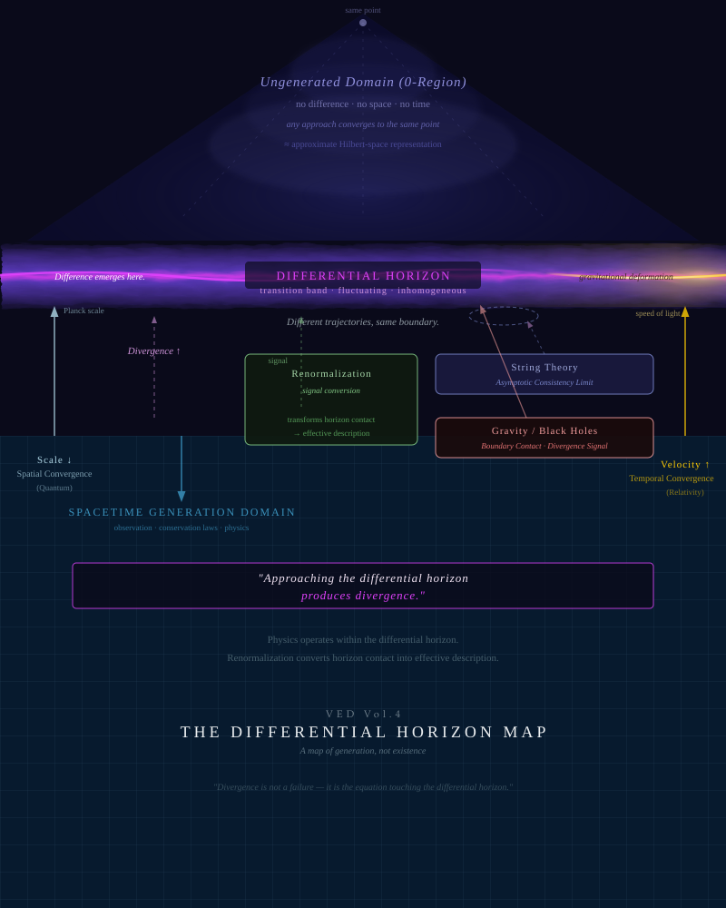

# Vortical Enclosure Dynamics (VED)

> VED は、空間・時間・物質・重力・認知を、ただ一つの公理 **「差がある」**
> から始まる単一の生成シーケンスから導出しようとする理論的枠組みです。

## VED とは何か（最初にこれを読んでください）

VED は **生成的な構造の枠組み** です。差異が存在するという単一の公理から出発し、
次の一本のシーケンスをたどります。

```text
差異 -> 勾配 -> 流れ -> 渦 -> 閉包（enclosure）-> 非閉包
```

そして、各記述層（物理・生物・認知・意識・知性・社会）が、このシーケンスの
内側にどう再配置されうるかを問います。この見方では、時間は因果ログ蓄積の効果、
空間は因果関係によって誘導される構造、物質や幾何は安定化した閉包現象として扱われ、
初めから与えられた前提とは見なされません。

最初に保持しておくべきことが二つあります。

1. **公理はただ一つ、「差がある」だけです。**
   勾配・流れ・渦・閉包・因果ログ・非閉包は、すべて差異から *生成された* ものです。
   これら派生項のいずれも基盤ではありません。とりわけ **因果ログは生成された痕跡で
   あって、出発点ではありません。** 要約がログ（あるいは渦、閉包）を VED の原始概念
   として扱っているなら、それは階層を反転させています。
   [Generative Sequence](docs/navigation/generative_sequence.md) を参照。

2. **これらの語は領域ラベルではなく、構造上の位置を指します。**
   「vortex」「enclosure」「dynamics」は生成シーケンス上の位置を示すもので、
   流体・容器・機械的運動についての主張ではありません。
   [Name Misreadings](docs/navigation/name_misreadings.md) を参照。

## VED が何でないか（意図的に短く）

- **流体力学・CFD の枠組みではありません。** 渦／閉包の語彙は生成的・構造的であって、
  流体力学的ではありません。Navier--Stokes も lid-driven cavity もありません。流体力学は
  ときに比喩として現れることはあっても、方法論ではありません。
- **複雑系・散逸構造理論に還元できません。** 語彙は重なりますが、VED は単一の公理から
  空間・時間・物質・認知を複数の層にわたって導出します。
  [Not Just Complex Systems](docs/navigation/not_just_complex_systems.md) を参照。
- **既存の物理学・認知科学の置換ではありません。** VED はそれらを差分発展シーケンスの
  内側に再配置するもので、覆そうとするものではありません。

> これらの否定は意図的に短くし、肯定的な定義の *後ろ* に置いています。否定は提示済みの
> 枠組みに付けたガードレールであって、枠組みそのものではありません。

## Navigation Layer

| Guide | 目的 |
|---|---|
| [Generative Sequence](docs/navigation/generative_sequence.md) | 順序と階層を固定する。差異が唯一の公理であり、ログは派生した痕跡である。 |
| [Concept Map](docs/navigation/concept_map.md) | VED/IFGT の主要概念がリポジトリ内のどこに現れるかを探すための地図。 |
| [Translation Table](docs/navigation/translation_table.md) | 物理層、IFGT、認知層、社会層のあいだで語彙を対応づける表。 |
| [Theory Relationships](docs/navigation/theory_relationships.md) | 既存理論との関係を、置換主張ではなく再配置として読むための案内。 |
| [Conceptual Neighbors](docs/navigation/conceptual_neighbors.md) | 複雑系・autopoiesis・FEP などのカテゴリ的重なりを、還元せずに整理する。 |
| [Not Just Complex Systems](docs/navigation/not_just_complex_systems.md) | 複雑系・散逸構造の意味井戸に対して境界を保持するための文書。 |
| [Enactivism Comparison](docs/navigation/enactivism_comparison.md) | 身体化された認知、環境結合、生命・認知層との関係を整理する比較文書。 |
| [Reading Paths](docs/navigation/reading_paths.md) | 読者の目的別に入口を選ぶための読書経路。 |
| [Name Misreadings](docs/navigation/name_misreadings.md) | VED 名称や用語が CFD や通常の物体語彙へ吸着するのを防ぐための入口ガイド。 |
| [Concept Traps](docs/navigation/concept_traps.md) | VED 用語が既存概念へ自動的に吸着する高頻度パターンを整理する文書。 |
| [Simulation Reading Guide](docs/navigation/simulation_reading_guide.md) | Vol.4 のシミュレーションを過剰解釈せずに読むためのガイド。 |
| [Common Misreadings](docs/navigation/common_misreadings.md) | 既存概念への自動吸着による誤読を避けるための索引。 |
| [AI Summary Tests](docs/navigation/ai_summary_tests.md) | AI 要約テストと再テスト結果を記録するためのテンプレート。 |



## 読み始める前に

VED は、完成済みの物理理論というより、構造を読むための言語として読むのが適切です。

このリポジトリには、理論的提案、概念モデル、探索的シミュレーション、既存理論の
再配置の試みが含まれています。各セクションは異なる抽象度で書かれているため、
ファイルを任意の順序で読むよりも、概念地図と読書経路を使って読むことを推奨します。

このリポジトリは、初回 arXiv 投稿のためのソース公開・研究背景提示を目的として、
arXiv ID の確定前に先行公開しています。arXiv ID は投稿承認後に追記します。

## 論文

- [VED Vol.1 — Foundations: Minimal Axiom, Causal Logs, Time and Space](paper/vol1/main.pdf)  
  arXiv ID は未確定
- [VED Vol.2 — Closure Geometry and the Standard Model](paper/vol2/main.pdf)  
  arXiv ID は未確定
- [VED Vol.3 — Gravity, Black Holes, and Cosmology](paper/vol3/main.pdf)  
  arXiv ID は未確定
- [VED Vol.4 — The Differential Horizon: Divergence, Renormalization, and the Boundary of Generation](paper/vol4/main.pdf)  
  arXiv ID は未確定  
  2026年5月に大幅改訂。registered difference、trace formation、local Differential Horizons を中核的な記述枠組みとして導入しました。Divergence は boundary signal として、renormalization は boundary contact の finite re-expression として読み替えられます。動的バリア（§13）は Differential Horizon Principle の最小形として再解釈されています。
- [IFGT — Information Field Geometry Theory](Information-Field-Geometry-Theory/main.pdf)  
  arXiv ID は未確定
- [Bio-IFGT — Biological Morphogenesis as Information-Flow Attractor Dynamics](bio-ifgt/main.pdf)  
  [Japanese PDF](bio-ifgt/main_ja.pdf) available; arXiv ID は未確定
- [Conceptual Topography — A Field-Theoretic Account of Conceptual Landscapes](./conceptual-topography/main.pdf)  
  arXiv ID は未確定
- [A Non-Generative Account of Consciousness — Temporal Non-Closure and Cross-Scale Log Referencing](./consciousness/main.pdf)  
  [Japanese PDF](./consciousness/main_ja.pdf) available; arXiv ID は未確定
- [Intelligence Part I — Structural Constraints on Intelligence as a Dynamical Phenomenon](./intelligence-part1/main.pdf)  
  [Japanese PDF](./intelligence-part1/main_ja.pdf) available; arXiv ID は未確定
- [Intelligence Part II — Non-Closure of Inference, Externalization of Stopping, and Emergent Stopping Layers](./intelligence-part2/main.pdf)  
  [Japanese PDF](./intelligence-part2/main_ja.pdf) available; English TeX draft in progress

投稿用 PDF コピーは [`arXiv_pdf/`](arXiv_pdf/) にまとめています。

## 現在の位置づけ

すべての巻は、このリポジトリ内でプレプリントとして公開されています。arXiv 投稿は
`gr-qc` および `physics.gen-ph` の endorsement 待ちです。その間、GitHub を暫定的な
主要引用元として扱います。

Vol.4 は 2026年5月に構造的な大改訂を行い、観測と記述の枠組みを全章にわたって深めました。
この改訂では、registered difference、descriptive window、pastified texture、boundary signal、
local horizon-form、open generative framework という統一語彙が 14 セクション全体を貫く形で
導入されています。

Vol.1–Vol.3 には、定量的導出に関してなお未解決の部分があります。

## 概念的な概要

VED は、差異から勾配、流れ、渦、閉包が生まれ、そこから有効な物理構造が立ち上がるという
生成順序を提案します。公理はただ一つ「差がある」であり、勾配・流れ・渦・閉包・因果ログ・
非閉包は、その順序ですべて差異から生成されます。

この見方では、時間は因果ログの蓄積の効果、空間は因果関係によって誘導される構造、
物質や幾何は安定化した閉包現象として扱われ、初めから与えられた前提とは見なされません。
因果ログは、差異が登録され持続したときに現れる生成された痕跡であって、差異と並ぶ
共-原始概念ではありません。明示的な階層は
[Generative Sequence](docs/navigation/generative_sequence.md) を参照してください。

この枠組みは、完成済みの物理理論というより、構造的な研究プログラムとして読むことを
意図しています。詳細な方程式、強い主張、方法論的立場、未解決問題は [`docs/`](docs/) に
分け、ここでは入口ページとして必要な情報に絞っています。

関連ドキュメント:

- [Overview](docs/00_overview.md)
- [Core Equations](docs/core_equations.md)
- [Key Correspondences](docs/correspondences.md)
- [Claims](docs/claims.md)
- [Methodology](docs/methodology.md)

## リポジトリ構成

```txt
docs/                              解説文書、方法論、主張整理、未解決問題
figures/                           図表・概念図
paper/                             Vol.1–Vol.4 の LaTeX ソースと論文用図版
Information-Field-Geometry-Theory/ IFGT のソース、図版、PDF
bio-ifgt/                          IFGT/VED の生物学的 coarse-graining
conceptual-topography/             IFGT/VED の認知・社会的応用層
consciousness/                     時間的非閉包とログ参照としての意識論
intelligence-part1/                非閉包的な力学的現象としての知性論 Part I
intelligence-part2/                外化された停止と創発的停止層
arXiv_pdf/                         投稿用 PDF コピー
notes/                             作業ノートと補足資料
```

- `bio-ifgt/`: IFGT/VED の生物学的 coarse-graining。生命、発生、
  遺伝子媒介的制約、知性を、完成形ではなく準閉包レジームとして記述します。
- `conceptual-topography/`: IFGT/VED の認知・社会的応用層。概念、理解、
  言語トークン、共有された概念地形を、投影された準閉包レジームとして記述します。
- `consciousness/`: 意識を、生成された対象ではなく、時間的非閉包、
  speed-scale orchestration、ログ参照として開かれるレジームとして記述する
  応用層です。IFGT 変数は、生物的・認知的観測窓に射影された有効変数として扱います。
- `intelligence-part1/`: VED/IFGT 応用系列における知性層の第一論文です。
  知性を、連結状態空間、時間順序、グローバル制約、外化された停止構造を要請する
  local horizon-form によって制約される力学的現象として扱います。
- `intelligence-part2/`: 知性層の第二論文です。推論の非閉包性を、外化された停止、
  創発的停止層、宗教・科学・社会的合意などの歴史的な停止運用システムへ展開します。

## 推奨読書順

一般読者向け:

1. VED Vol.1 — Foundations
2. VED Vol.3 — Gravity and Cosmology
3. IFGT — Information and Observation
4. VED Vol.4 — The Differential Horizon
5. VED Vol.2 — Closure Geometry and the Standard Model

物理背景のある読者向け:

1. VED Vol.1 — Foundations
2. VED Vol.3 — Gravity and Cosmology
3. VED Vol.4 — The Differential Horizon
4. IFGT — Information and Observation
5. VED Vol.2 — Closure Geometry and the Standard Model

Vol.2 は、基礎概念と初期巻で導入される構造的前提への依存が最も強いため、あえて後ろに
置いています。一般読者には、情報流・勾配・準閉包を比較的具体的に導入する IFGT を Vol.4 の
前に読む順序が向いています。一方、物理背景のある読者には、Differential Horizon の枠組みを
先に読むことで、IFGT が観測境界の手前側の運動を記述していることが見えやすくなります。

## 公開モデル

- arXiv には固定された引用可能版を置きます。
- GitHub には更新中のソース、図、修正、補足ノートを置きます。
- note や一般向け記事には解釈的で導入的な説明を置きます。

## 未解決問題

この枠組みには、微視的形式化、定量的予測、重力の基準解、量子的振る舞いの扱いなど、
引き続き検討すべき点があります。詳細は [Open Problems](docs/open_problems.md) を参照してください。

## 引用

arXiv ID が確定する前に本枠組みを参照または議論する場合は、このリポジトリを引用して
ください。arXiv 参照は投稿承認後に追記します。リポジトリの基本メタデータは
[CITATION.cff](CITATION.cff) にあります。

## ライセンス

特記のない限り、理論文書と図版は CC BY 4.0 で公開します。詳細は [LICENSE](LICENSE) を
参照してください。

## 著者の立場

このリポジトリは、完成宣言ではなく、更新され続ける研究枠組みとして提示されています。
短い注記はここに残し、より詳しい立場説明は [Author Position](docs/author_position.md) に
分けています。
