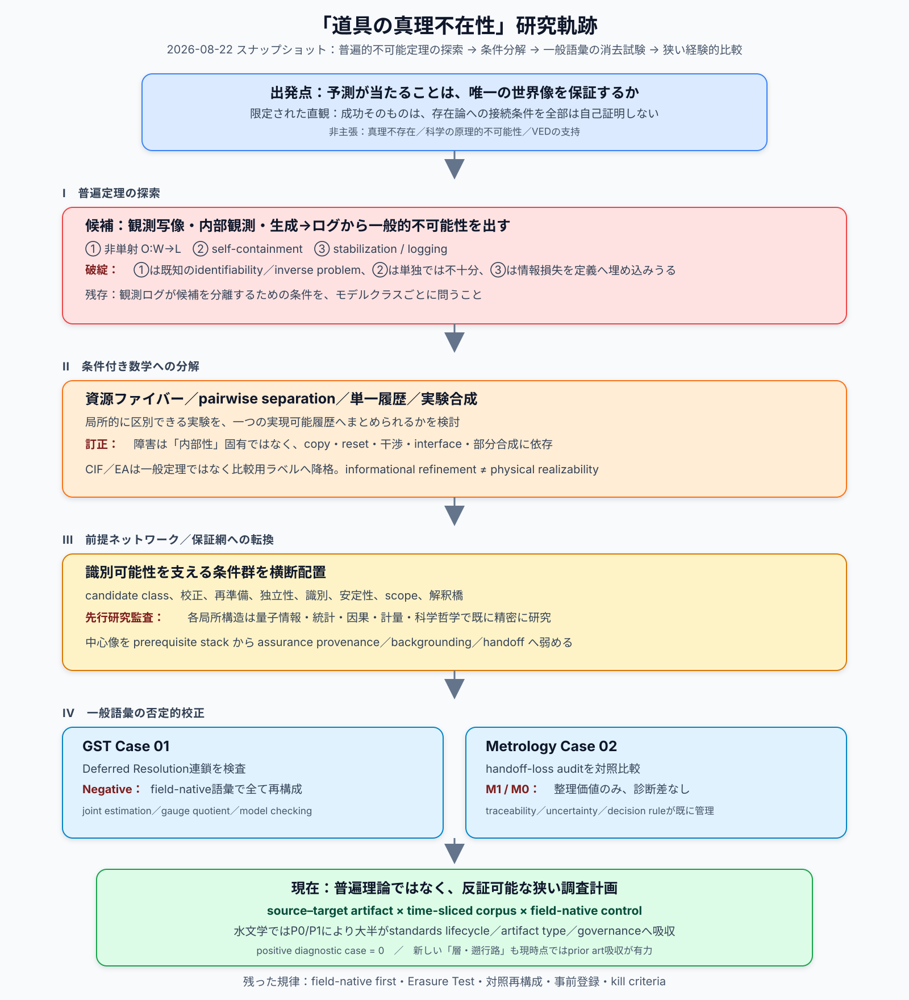

# 「道具の真理不在性」研究軌跡

## 2026-08-22 スナップショット — 普遍定理の探索から狭い経験的比較まで

- **Status:** retrospective research map / working summary
- **Date:** 2026-08-22
- **Snapshot ID:** `TTA-TRAJECTORY-2026-08-22`
- **Scope:** 「観測・予測成功と存在論的一意性」の問いから、水文学・技術標準の比較検査まで
- **最重要留保:** 本文は新定理、新方法論、真理不存在、科学の不可能性、VEDの正しさを主張しない

## 1. 一文でまとめると

出発点は「予測が当たることだけから、世界が唯一この存在論であるといえるのか」という問いだった。しかし、普遍的不可能定理の候補は既知の識別可能性問題、追加条件を要する自己測定問題、または定義に結論を埋め込んだ情報損失へ分解された。その後に提案した一般監査語彙も、GST、計量学、水文学、技術標準との比較で分野固有の既存語彙に繰り返し吸収された。現在残っているのは、普遍理論ではなく、**指定された文書連鎖において、条件・適用範囲・不確かさの重要な変化を、同時代資料だけからfield-native review以上に検出できるか**という狭い経験的研究計画である。

## 2. 最初の問いは何だったか

旧作業名「道具の真理不在性」が意味していたのは、真理の不存在ではない。より限定された直観は次だった。

> 観測・予測・計算の成功そのものは、その成功を唯一の存在論的世界像へ接続するために用いたすべての補助条件まで、同時には自己証明しない。

この直観には現在も論理的な意味がある。しかし、それは新しい数学定理ではない。また、補助条件は成功と独立した校正、実験設計、再現、統計、理論によって非常に強く支持されうる。「自己証明しない」と「根拠がない」は別である。

## 3. 研究の変遷

### 3.1 普遍的不可能定理を探した段階

| 段階 | 当初の仮説 | 何によって壊れたか | 残ったもの |
|---|---|---|---|
| 観測写像 | 非単射な (O:W\to L) なら存在論的一意性は得られない | 「非単射なら逆像が一意でない」は初等的で、inverse problems、identifiability、observational equivalence、quotientが既に扱う | 候補クラスと観測同値類を明示する必要 |
| 内部観測・自己包含 | 観測者が世界内部なら、自己を含む世界を完全に識別できない | 自己包含だけでは非識別性は出ない。自己記述可能な系もあり、Breuer/Wolpert型制約にも追加条件が要る | observerの位置ではなく、資源・因果・interface条件を見る必要 |
| 生成―ログ非同型 | generation→stabilization→logという過程が非同型性を強制する | 「安定化」を情報損失として定義すれば循環。coarse graining、sufficient statistics、Blackwell comparison、bisimulation等が既に近い問題を扱う | どの変換が何を保存するかを個別に問う必要 |
| 資源階層 | 観測資源を増やしても存在論的fiberが一般に残る | 有限・無限候補、モデルクラス、資源順序で結論が変わる。極限で一点化する例もある | resource-bounded identifiabilityという条件付き問題 |

ここで最初の大きな撤回が起きた。

> **「観測成功には普遍的な存在論的非一意性がある」という新定理は得られなかった。**

### 3.2 「内部性」から実験の合成可能性へ

次に、各候補対を区別する実験があることと、全候補を一つの適応的履歴で区別できることを分けた。

\[
\forall\theta\neq\theta'\;\exists e
\qquad\text{と}\qquad
\exists\sigma\;\forall\theta\neq\theta'
\]

二ビットの一方を読むと他方を壊す例は、pairwise separationがglobal adaptive separatorを保証しないことを示す。しかし、同じsingle-copy・reset不能・破壊的操作という制約を外部観測者にも与えれば同じ障害が生じる。

このため、問題は次のように訂正された。

- `inside / outside`というラベル単独は数学的条件ではない。
- 重要なのは、copy、reset、fresh preparation、memory、干渉、因果チャネル、部分合成である。
- informational refinementとphysical joint realizabilityは別である。
- CIFやEAは、既存のより精密なfield-native概念を置換する一般理論ではなく、比較用の索引語にすぎない。

### 3.3 「前提スタック」から保証の出所へ

普遍定理を諦めた後、識別を成立させる条件を「科学的識別可能性の前提スタック／ネットワーク」として並べた。候補には、モデルクラス、実験可能性、再準備、独立性、校正、記録、統計的識別、逆問題の安定性、予測検証、解釈橋などがあった。

ここでも二つの訂正が入った。

1. 条件は一本道ではなく、代替・支援・feedback・cross-impactを持つ。
2. 各条件は既存の統計、制御、量子情報、計量、因果推論、科学哲学で既に高度に研究されている。

そのため中心像は、独自のprerequisite networkから、より弱い作業語である`assurance provenance`、`backgrounding`、`handoff`へ移った。ただし、これらにもassurance case、traceability、evidence graph、model validationなど強い先行研究がある。

### 3.4 量子論でのprior-art reconstruction

量子状態トモグラフィー、SPAM/GST、状態識別、Bell実験、contextuality、ontological models、解釈論を既存研究だけから再構成した。その結果、次の区別は重要だが、ほぼすべて既知だった。

- ideal identifiability / finite-sample estimability / inverse stability
- repeated preparation / single-copy access
- no-cloning / incompatibility / contextuality / destructive measurement
- Bell-locality、parameter independence、outcome independence、measurement independence、各loophole
- within-model identification / model-class adequacy / interpretation

量子ケースの暫定判定は、**既存ノードと主要edgeの大半が既に接続されており、弱いcross-domain visibilityだけが残る**というものだった。これは新しい方法論の証拠ではない。

## 4. 一般語彙を実例で消してみた結果

### 4.1 GST：Deferred Resolutionの凍結されたnegative result

GST系列に、`resolution → boundary relocation → target reformulation → new adequacy boundary`という反復構造を見ようとした。しかし、固有語彙を消すと、内容は次の既存語でより正確に記述できた。

- conditional inverse problem
- nuisance / reference parameter promotion
- joint estimation
- identifiability modulo gauge
- quotient parameterization
- model checking
- model-specific extension

したがってDeferred Resolutionは独立概念として採用されず、Case 01はfrozen negative resultになった。

### 4.2 計量学：handoff auditのnegative control

計量学では、measurement result、uncertainty、traceability、calibration scope、conformity decisionの受け渡しをgeneric auditで追跡し、field-native controlと比較した。しかし、同じ問題は計量学自身の語彙と制度で既に明示されていた。

- 最終判定は **M1 — organizational value**。
- より厳しく見ればM0も妥当。
- 診断的・方法論的な追加価値を示すM2/M3は棄却された。
- 2019 SI改定は、あらゆる依存が移送され続けるという読みへのclosure counterexampleにもなった。

この二ケースから得たのは、新しい科学的機構ではなく、一般語彙を棄却する規律だった。

> 固有語彙を消しても判断が変わらなければ、その価値は表示・索引に留まる。消した方が精密になるなら、そのケースでは積極的に降格する。

## 5. Web of ConstraintsからValidation Basisへ

次に、scientific claimを単位として、observability、applicability、uncertainty、model、calibration、scopeを`web of constraints`として描き、claim transportを追跡する案を検討した。

しかし、次の問題があった。

- observabilityのD1–D4分類は、instrumental access、structural identifiability、estimability、resource limitation、in-principle impossibilityを混同する。
- transportは単一関係ではなく、causal transport、EFT matching、measurement→decision、evidence→recommendation、model→predictionなどで必要条件が異なる。
- cross-field boundaryは本質変数ではない。同一分野内でもextrapolationは起こり、異分野間でも明示的licenseが整備されうる。
- `web`や`claim transport`は、診断を変えなければ比喩または整理語に留まる。

そこで問題はさらに狭められた。現在の`Validation Basis Transition Working Note v0.1`が問うのは、次だけである。

> 指定されたsource–target claim extensionで、sourceのwarrantにmaterialだった条件がtargetで変わり、既存のinvariance、robustness、transport、applicability、target validationで被覆されず、対象時点の文書にも明記されない場合を、構造化比較がfield-native reviewより一意に、または再現可能に検出できるか。

ここで`validation basis`は新概念ではなく、evidence、assumptions、scope、uncertainty treatment、acceptance criteriaを一時的に並べる索引語である。現在の証拠はnegative control 2件、positive diagnostic case 0件である。

## 6. 水文学で何が起きたか

### 6.1 仮説ではなくartifact chainを探す段階へ

水文学では、Bulletin 17B系のsite-specific flood-frequency estimateから、levee、floodplain、bridge等の実際のtarget artifactへ至るsource-firstな文書連鎖を探し始めた。ここではまだpositive / negative判定をせず、artifact date、target use、claim type、source–target差、同時代文献、claimed bridge、actual coverage、selection routeを台帳化する方針にした。

これは重要な転換だった。

> 「よい仮説を考える」段階から、「audit-readyな文書連鎖が実在するか」で研究が進退する段階へ移った。

### 6.2 「負の知識保存」仮説の縮小

Bulletin 17B→17C→FEMA guidanceを読むと、future studies、未評価事項、更新、逸脱、適用範囲などの記録が見つかった。当初はこれを「失敗の教訓」や「negative knowledgeの保存」と読んだが、v0.2では次へ後退した。

> **Documentary continuity identified; preservation effectiveness untested.**

つまり、文書上の継続性は確認できても、それが忘却を防いだ、再前景化を容易にした、実務を改善した、とは言えない。

### 6.3 P0：generic standards baseline

水文学で見つけた14コードをISO/IEC等の一般的技術標準と比較すると、10コードがgeneric baselineで再現された。これは「水文学固有の認識論的機構」という読みを大幅に弱めた。

ただし、この結果から直ちに「科学一般が前提を再検討可能にしている」と一般化することもできない。P0が強く示すのは、**観察された文書形式が水文学に一意ではない**ことまでであり、科学一般での普遍性や実効性までは示さない。

### 6.4 P1-reduced：NONEVALも残らなかった

残存候補だった`The Work Group did not evaluate...`型の非評価宣言をmetrology / GRADEと比べた。表現上の差はあったが、artifact typeとgovernance structureで説明でき、実質n=1だった。そのためcomparative methodologyは終了し、comparative reviewへ降格した。

ここで重要なのは、分野別の「深い認識論差」が発見されたのではなく、欠落や不確かさの帰属先が文書機能によって違って見えた可能性が高いことである。

## 7. 最新の比較軸：「層」と「再検討接続点」は残るか

最新の候補は、「科学は前提を疑えるか」ではなく、「通常運用で何を固定し、異常時にどの対象を再検討できるか」を比較することだった。しかし現時点のadversarialな判定は厳しい。

- data→model→decisionという順序付きの普遍的な層は仮定できない。
- データ、推定、不確かさ、モデル、scope、decision、governance、problem framingは、種類の異なる対象を一列に並べている。
- 「遡行路」「接続点」は、traceability、model criticism、validation、change control、impact analysis、review trigger、escalation、living guideline、single/double-loop learning等へかなり吸収される。
- 文書から観察できるのは、trigger、明示参照、改訂対象、authority、version transitionなどに限られる。再評価速度、合意コスト、適応性などは運用記録やインタビューなしには推定できない。

したがって現時点の位置づけは、**新しい方法論ではなく、prior artに大きく吸収されるevent-level comparative review候補**である。比較するなら「分野」ではなく、同機能のartifactと具体的revision eventを揃え、trigger、reviewed object、authority、propagation、observable outcomeを見る必要がある。

## 8. 2026-08-22時点で言えること

比較的安全なのは次である。

1. 観測・予測成功と、唯一の存在論的解釈は論理的に同じではない。
2. 両者を接続する識別、校正、モデル範囲、独立性、実験設計、解釈原理は、既存研究で個別に強く扱われている。
3. self-containmentやinside/outsideというラベルだけから普遍的不可能性は出ない。
4. 一般監査語彙は、整った物語を作れても診断内容を加えないことがある。GSTと計量学はその明示的negative controlである。
5. 水文学で見つけた文書形式の大半は、generic standards lifecycleで説明可能だった。
6. 文書に改訂経路があることと、根本前提が実際に再検討されることは別である。
7. 現時点で残る研究価値は、主として失敗履歴、先行研究への復帰、対照比較、Erasure Test、事前登録、kill criteriaという訂正手続にある。

## 9. 2026-08-22時点で言えないこと

- 真理そのものが存在しない。
- 科学は真理へ到達できない。
- 観測成功は存在論的一意性を常に排除する。
- 内部観測者は原理的に世界を識別できない。
- 科学一般に共通する新しい前提ネットワークを確立した。
- assurance provenance、handoff、validation basis、再検討接続点が新概念である。
- 一般監査がfield-native reviewより優れる。
- 科学一般が前提を疑う道を必ず開いている。
- 文書上のrevision pathが実効的なepistemic revisionを保証する。
- 水文学、GST、計量学から全科学へ一般化できる。
- この系列がVEDへの証拠的支持を与える。

## 10. 現在の研究プログラムを一行で表すと

現在残っている最も狭い経験的問いは、次である。

> **固定時点の同一資料について、field-native controlと構造化source–target comparisonを独立に行ったとき、後者だけがmaterialかつ未明示でdecision-relevantな条件差を、許容可能な偽陽性率で再現可能に検出するか。**

これが確認されなければ、working programはreview / synthesisへ降格または終了する。読みやすい図や表を作っただけでは成功としない。

## 11. 研究全体を通じて残った方法上の規律

1. **Field-native first:** 一般語彙を置く前に、その分野自身の最強の説明を再構成する。
2. **Erasure Test:** 固有語彙を消しても結論が残るなら、追加価値を表示・索引以上に数えない。
3. **Control reconstruction:** generic auditと同じ資料をfield-native語彙だけで読む対照を作る。
4. **Historical and logical separation:** 論文の時系列を論理的依存関係と混同しない。
5. **Artifact / institution / field separation:** 一文書のomission、制度的未運用、分野レベルの概念欠如を分ける。
6. **Time-sliced audit:** 後知恵を遮断し、対象時点で利用可能だった資料だけで検査する。
7. **Selection-route logging:** source-first、target-first、archive-sampled、known-failure-derived、convenienceを記録する。
8. **Preregistered kill criteria:** 差が出なければ語彙、仮説、研究計画を降格・終了する。

## 12. 主要ノートへの案内

- 中心的な撤回履歴：[`tool_truth_absence_working_note_v0.4.md`](./tool_truth_absence_working_note_v0.4.md)
- 量子論の既存研究再構成：[`quantum_identifiability_prior_art_network.md`](./quantum_identifiability_prior_art_network.md)
- GSTの凍結negative result：[`deferred_resolution_case_01_gst_v0.2.md`](./deferred_resolution_case_01_gst_v0.2.md)
- 計量学の比較結果：[`scientific_assurance_case_02_metrology_comparison.md`](./scientific_assurance_case_02_metrology_comparison.md)
- Web of Constraints構想の敵対的レビュー：[`web_of_constraints_methodology_adversarial_review.md`](./web_of_constraints_methodology_adversarial_review.md)
- 現在の狭い研究計画：[`validation_basis_transition_working_note_v0.1.md`](./validation_basis_transition_working_note_v0.1.md)
- 水文学artifact探索台帳：[`case_01_hydro_target_artifact_discovery_v0.1.md`](./case_01_hydro_target_artifact_discovery_v0.1.md)
- 水文学文書系列の訂正版：[`hydrology_negative_knowledge_preservation_note_v0.2.md`](./hydrology_negative_knowledge_preservation_note_v0.2.md)
- 一般技術標準との対照：[`p0_generic_standards_baseline_v0.1.md`](./p0_generic_standards_baseline_v0.1.md)
- `NONEVAL`縮小比較：[`p1r_noneval_two_field_check_v0.1.md`](./p1r_noneval_two_field_check_v0.1.md)

## 13. 現時点の総括

この研究系列は、「観測の奥に普遍的な不可知構造を発見した」ものではない。むしろ、そうした強い像を数学、先行研究、反例、実例比較によって順番に壊し、既存分野がすでに持つ精密な保証・改訂・適用範囲の語彙へ戻していった記録である。

最も守れる成果は、新しい真理論ではなく、次の自己訂正原理である。

> **一般概念がfield-native reconstructionよりよい診断を生まないなら捨てる。残る問いは、実際の資料と対照比較でのみ生かす。**
