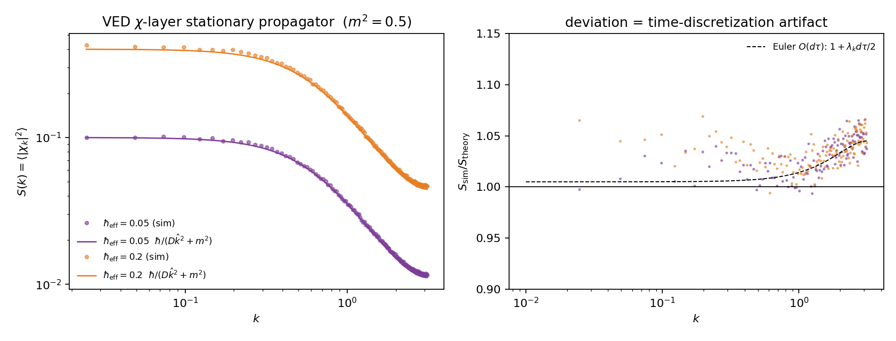
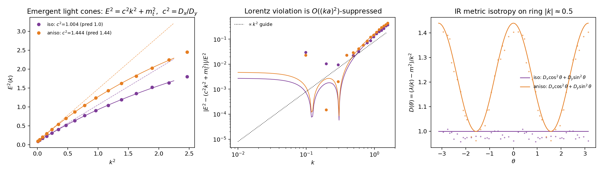
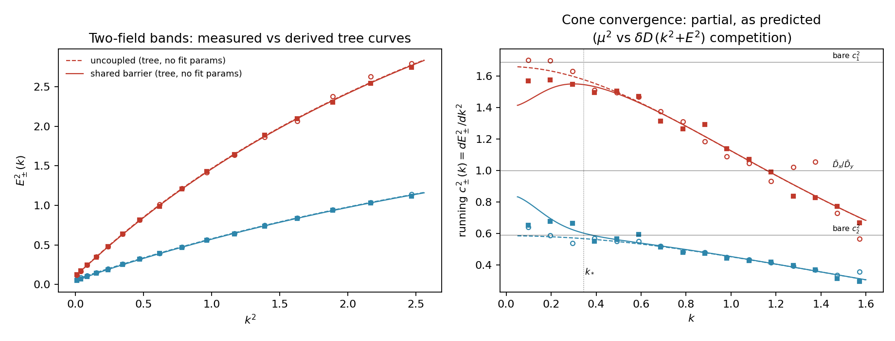
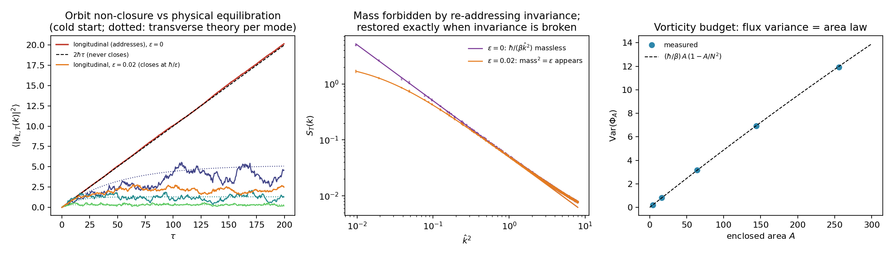

# VEDの確率的量子化:χ層の橋

**状態:** ワーキングノート(フェーズ1–4実行済み、および二場Collins実験)。解析的導出+数値確認。未公開。§0に従い「実行済み」は準閉包を意味する:各フェーズは名指しされ監査された残差を残している(§8)。
**依存:** VED核方程式(`C_ij`、生成順位1)、IFGT閉包動力学(`∂C/∂τ`方程式)。
**辺の型:** `derives_from`(VED核)、`structural_extension_of`(IFGT)。

## 0. 監査規律:残差と転位

VEDの根幹の主張は「何も完全には閉じない——閉包は常に準閉包にすぎない」というものである。これを本モジュールに適用すると、物理的帰結だけでなく方法論的帰結が生じる:本文中のいかなる導出も、残差を**処分した**ものとして読んではならない。ある量が保護される・相殺される・消えるとされる箇所は、必ず**対応する残差がどこへ行ったか**を名指しし、**その行き先固有の、独立に測定可能な署名**によって裏付けられなければならない。これは二場Collins実験(§7.5)から得た教訓そのものである:走る円錐速度`c²(k)`は「高kで分裂が残る」という物語の確認ではなく、その物語を発見に変えた独立測定だった。物理学にはこの点で失敗例と成功例の両方がある:宇宙定数問題は、行き先を名指しされず検証もされないまま相殺された残差であり(この上に築かれた自然性の論法はその後疑問視されている)、フェルミの4点理論は行き先への固執がW/Zボソンという実在の構造を生み出した残差だった。以下の規律は後者側に着地するよう設計されている。

**規律。**「Xは保護される/Xは相殺する/Xは消える」という形式の主張は、以下が満たされるまで暫定的に**未説明の相殺**へ格下げされる:①具体的な行き先の層・セクター・観測量のランクが名指しされること、②その行き先で、他の方法では予言されなかったはずの量が測定または導出されること、③その量の値が、残差の期待される大きさと照合されること(存在を主張するだけでは不可)。③を欠く場合、「どこか別の場所へ行った」は発見ではなく単なる言葉であり、そのように明示されねばならない。

**本モジュール自身の主張への第一回自己検査:**

| 主張 | 残差 | 名指しされた行き先 | 独立署名 | 状態 |
|---|---|---|---|---|
| 一次(one-loop)での質量保護(§5、Liouville) | tadpole補正 | 平均`<χ>`(一点観測量) | 測定済み、小数4桁一致 | **監査済:転位** |
| 二場の円錐分裂(§7.5) | UV局在の非普遍性 | 大kでの走る`c²(k)` | 直接測定済み | **監査済:転位** |
| C層輸送を避けχ層を選択(§3) | 詳細釣り合いの破れ | KPZ/非平衡セクター | 未測定 | 未解決 |
| C層での障壁結合(§7.5) | χの非勾配ドリフト | 上記と同じ非平衡セクター | 未測定 | 未解決 |
| 量子セクターに必要な`hbar_eff`/`D`の一様性(§2の2、§8の2) | ——(まだ発見された相殺ではなく制約) | 臨界相の揺らぎ統計 | 未測定 | 未解決 |
| 再アドレス不変性によるゲージセクターの質量保護(§7.7) | 縦(質量になるはずだった)自由度 | 非平衡化するゲージ軌道 | 軌道成長`2ℏτ`を測定、傾き0.1009対0.100;逆向き:破れ`ε`は質量を復元し**かつ**軌道を閉じる | **監査済:転位、往復** |

3項目が規律を通過し、3項目は未解決のまま残る——「残差」という語彙だけで解決済みと扱ってはならない。

**自己適用(義務、任意ではない)。** この規律自体も閉包の候補であり、自らの規則によって監査される。その残差は、行き先が名指しされ署名が探索されたが結論が出ない場合である——そうしたケースは、それでも転位を主張することで解決してはならず、必要な限り無期限に未解決のまま残る。閉じない残差を追跡するための規律自身が早々に閉じてしまえば、それが守るべき原理そのものを反証してしまう。**したがってこの節は決して完成しない。** 新しいフェーズ・新しい主張のたびに——上記の3つの未解決項目、および今後「転位」を測定なしに援用するいかなる主張も含めて——再び開かれる。

## 本モジュールの主張(正の定義)

ユークリッド量子場理論は、観測時間`τ`における**VED閉包動力学の定常解**である。これは比喩ではない:VED/IFGT閉包方程式をその自然な加法チャートに書き直すとLangevin方程式になり、その定常測度が`exp(-S/hbar_eff)`であり、そこからOsterwalder–Schrader再構成によってヒルベルト空間・ハミルトニアン・物理時間`t`のユニタリ発展が定理として従う、という主張である。VEDが当初から置いていた`τ`(生成の流れ)と`t`(沈殿した内部幾何)の分離は、Parisi–Wu枠組みが要求する分離と正確に一致する。

本モジュールは標準模型の作用の導出を**主張しない**。作用選択は未解決問題である(§8.1)。

## 1. 自然なチャート:χ

`C_ij`は`[0, 1)`に有界でありLangevin変数として不適。VED核方程式

```
C_ij = 1 - exp(-λ ρ_i H_ij)
```

が非有界の加法変数を最初から指定している:

```
χ_ij ≡ -ln(1 - C_ij) = λ ρ_i H_ij      (差への累積曝露量)
```

写像`e^{-χ} = 1 - C`は**Cole–Hopf変換**そのもの:指数閉包則は、KPZ成長族を線形化する標準的変数変換と同一形である。飽和の非線形性は座標の性質(kinematics)であって動力学ではない。

## 2. 導出された制約

IFGT方程式`∂C/∂τ = aΔ(1 - C/C*) - ΓC - κ_B/(C_max - C) - ∇·J_C`をχチャートに書き直すと、追加の仮定なしに:

1. **量子セクターでは`C* = 1`。** `C* = 1`のとき、かつそのときに限り、Δ駆動がχに対して加法的になる。加法ノイズは平衡定常測度`exp(-S/hbar)`の成立条件であり(Itô/Stratonovich問題も消える)、`C* = 1`は仮定ではなく整合性からの導出。
2. **`hbar_eff = a² × S_Δ`**(揺動散逸関係)。プランク定数は差の場の揺らぎ強度——Δの「温度」——である(δΔ(速)とχ(遅)の二層分離の下で)。系:`hbar`の全辺一様性は`a² S_Δ`の一様性というVEDへの非自明な制約(候補:臨界相/活性相における揺らぎ強度の普遍性)。
3. **`m² = Γ e^{χ̄}` + 障壁曲率。** 場の質量=閉包の散逸率。同じ量がFokker–Planck生成子のスペクトルギャップ:**散逸が定常(量子)セクターの存在を保証する。** 緩和時間 `~ 1/m²`。
4. **Liouvilleポテンシャル。** ドリフトの積分は`V(χ) = Γ(e^χ - χ) + (障壁項) - <aΔ>χ`。創発場理論の結合定数は`Γ, κ_B`の関数——選ぶのではなく読み取る。
5. **OS陽性→ユニタリ性は定理。** 勾配流+加法ノイズは反射陽性な定常測度を与え、OS再構成がヒルベルト空間と`t`方向ユニタリ発展を構成する。`t`は沈殿した相関の内部幾何、`τ`はそれを生成した緩和流。
6. **質量ゼロ場は臨界性の上に住む。** `m² → 0`は臨界減速——緩和が完了しない。質量ゼロ(光子的)モードは「閉じ切らない」臨界領域にしか住めない:VEDの一行定義が量子セクター内部で回帰する。保護機構の候補はリンク変数のゲージ対称性(ノードの局所再アドレス不変性)、フェーズ4——**実現・測定済み、§7.7**。
7. **ローレンツ不変性=`D`の等方性**(再構成格子のd方向にわたる)。Collinsの微調整問題は「`D`の異方性は臨界固定点で無関係方向に流れるか」という単一のRG問題に圧縮される(フェーズ3;反証可能)。

## 3. 方程式(フェーズ1成果物)

```
∂χ/∂τ = D ∇²χ - V'(χ) + η
V'(χ)  = Γ(e^χ - 1) - aΔ̄                    (障壁項省略:χ̄は飽和から遠い)
<η(x,τ) η(x',τ')> = 2 hbar_eff δ(x-x') δ(τ-τ')
S[χ]   = ∫ d^d x [ (D/2)(∇χ)² + V(χ) ]
P*[χ] ∝ exp(-S[χ]/hbar_eff)
```

輸送はχ層に置く(`J_χ = -D∇χ`):輸送される基本量は累積履歴`H`であり、`C`はその飽和的読み出し。C層に置くとKPZ方程式が現れ`d ≥ 2`で詳細釣り合いが破れる——これは誤りではなく**残差セクター**として記録(§8.4)。

## 4. 数値確認(フェーズ2成果物)

1+1次元周期格子、`N = 256`、`D = 1`、`Γ = 0.25`、`aΔ̄ = 0.25`(`χ̄ = ln 2`、`m² = 0.5`)、Euler–Maruyama `dτ = 0.02`、5×10⁵ステップ、ノイズ強度2種。再現は`python3 simulate.py`。

| 検証 | 予測 | 測定 | 備考 |
|---|---|---|---|
| 定常プロパゲータ | `S(k) = hbar/(D k̂² + m²)` | 0.4%で一致 | Euler `O(dτ)`アーティファクト`1 + λ_k dτ/2`除去後(形状も確認、図1右) |
| FDTスケーリング | `S ∝ hbar_eff`、比4.000 | 4.019 | `hbar`が文字通りノイズ強度として作動 |
| スペクトルギャップ(ゼロモード) | `m² = 0.500` | 0.493 / 0.482 | 制約3の動的確認 |
| 平均シフト(tadpole) | `<χ> = χ̄ - <δχ²>/2` | 小数4桁一致 | Liouville `V''' = m²` |



## 5. 発見された構造:質量のLiouville保護

指数型ポテンシャルでは`V'' = V''' = V'''' = Γ e^χ`なので、一次(one-loop)の質量補正が恒等的に相殺する:

```
Δm² = (1/2) <δχ²> ( V'''' - V'''²/V'' ) = 0
```

数値的にも:平均はtadpole予測どおり正確にシフトする一方、`hbar`を4倍にしてもギャップは動かない。**指数閉包則`C = 1 - e^{-χ}`は、平均を押し下げながら質量(=散逸率=スペクトルギャップ)を一次で保護する。** 量子補正への剛性がVED核方程式の関数形自体に組み込まれている。未解決:一次を超えて成立するか(非繰り込み構造)——§8.5。

## 6. 橋の全景

```
C_ij = 1 - e^{-λρH}   →   τにおけるχ層Langevin   →   定常測度 exp(-S/hbar)      [フェーズ2:確認済]
                       →   OS再構成                →   創発tのユニタリQFT
                                                   →   光円錐、c^2 = D_x/D_y      [フェーズ3:測定済]
                       →   再アドレス不変性         →   Maxwellセクター、質量ゼロ  [フェーズ4:測定済]
```

## 7. フェーズ3:光円錐の創発と等方性の測定

設定:2+1次元——2次元格子`(x, y)`が`τ`で発展;定常状態は2次元ユークリッドQFT;OS再構成は`y`を創発時間に取る。**創発`t`におけるエネルギーとは、`y`方向に沈殿した相関の減衰率である**(伝達行列の極 `4 D_y sinh²(E/2) = D_x k̂_x² + m²`を各`k_x`について運動量空間でフィット、Euler `O(dτ)`アーティファクトは反復補正)。2運転:等方`D = (1, 1)`と異方`D = (1.44, 1)`。再現は`python3 simulate_phase3.py`。

| 検証 | 予測(等方 / 異方) | 測定(等方 / 異方) |
|---|---|---|
| 光円錐速度 `c² = D_x/D_y` | 1.0000 / 1.4400 | 1.0036 / 1.4440 |
| IR計量の異方性 `(A−B)/(A+B)` | 0 / +0.1803 | +0.0004 / +0.1807 |
| 質量 `m²`(Liouville保護、2次元相互作用系) | 0.0800 | 0.0808 / 0.0811 |
| `E² = c²k² + m_t²`からのズレ | `∝ k²` | 確認(図2中央) |



これにより制約7は声明から**測定**に昇格した:**ローレンツ不変性とは`D`の等方性であり**、光円錐は輸送テンソルの通りに傾く。超立方基板による相対論的分散からの破れは`(ka)² = (E/E_gen)²`で抑制される:線形次数のプランクスケール破れ(天体物理の到達時刻観測で強く制約済み)は予言*されず*、二次次数の破れが予言*される*——反証可能な窓。

**Collins微調整問題への構造的回答。** この問題は「複数の場が独立な運動項係数を持ち、各極限速度を一致させるよう調整せねばならない」ことを前提とする。VEDでは基板は`χ`一枚であり、創発するすべての励起は単一の`D`テンソルを継承する——**`c`の種普遍性は調整ではなく構造**。注意:単一場の励起には自動だが、異なる創発種(ゲージセクター、フェーズ4)での存続は指定検証項目——§8.3。残る露出——生成されたグラフ自体はなぜ等方か——は`hbar`一様性の制約と一項に合流する(§8.2):**`hbar`は基板の揺らぎ温度、`c`は基板の輸送等方性——どちらも同一の臨界相普遍性から降りてこなければならない。**

## 7.5 二場Collins実験:腕0–1

同一格子上の二つの`χ`場に反対向きの裸異方性`D₁ = (1.3, 0.77)`、`D₂ = (0.77, 1.3)`(裸円錐`c₁² = 1.69`、`c₂² = 0.59`)を与え、共有閉包予算`W = κ_B/(C_max − C₁ − C₂)`のみで結合する。これはポテンシャル結合であり、勾配流と詳細釣り合いが保たれるため、質量行列と双線形混合`μ²`は結合定常点まわりの`W`展開から**導出**される(フィットではない、κ_B = 0.02、C_max = 1.5)。測定:2×2交差スペクトル`S_ab(k)`を反転して`Λ(k) = hbar S⁻¹(k)`(Euler行列補正を反復)、バンドは`A(k_x)`と`B(k_x)`の一般化固有値として読む。再現は`python3 simulate_collins.py`(腕0–1;腕2——純四次RGテスト——は設計済みだが未実行、§8.3)。

| 量 | 導出値 | 測定値 | 備考 |
|---|---|---|---|
| 腕0(κ_B=0)質量行列の非対角成分 | 0 | 0.0003 | 対照:偽の混合なし |
| 腕1対角質量`M` | 0.0723 | 0.0739 | |
| 腕1混合`μ²` | 0.0314 | **0.0303** | フィットパラメータゼロで3%一致 |
| 両腕、バンド分散`E²_±(k)`対木曲線 | —— | 平均偏差0.6–1.1%、最大2.8%未満 | 図3左パネル |



**結果:部分収束であり、その部分性自体が木レベルの予言である。** 素朴な期待は共有予算が二つの円錐を完全に合体させることだった。そうはならない——正しい木レベルの主張は(時間方向の運動項を同じ展開に含めると見えてくる)、収束が`μ²`と`δD·(k² + E²)`の競合で支配されるというもの:**`E² ≪ μ²/δD`のモードは共通円錐を見る;その上のモードは分裂した裸円錐を見る。** 図3右パネルはまさにこれを示す:走る円錐速度`c²_±(k) = dE²_±/dk²`は小kで`D̄_x/D̄_y = 1`へ引き寄せられ、クロスオーバー`k_* ≈ 0.34`を過ぎると裸の値1.69/0.59へ戻っていく。

これによりCollinsへの構造的回答は一層から二層へ鋭くなる。単一基板継承は静的・運動学的な保護である。共有障壁の混合は、これに加えて**動的**な機構を与え、特にヌル円錐を優遇する:円錐速度が物理的に最も効くモード(軽く波長の長い励起)こそが、収束が最も強く働くモードである。ここから新しい未解決項目が直接出る:`μ² > M_diag`では対称点が混合に対して不安定化しうる——未検証、自発的対称性の破れの候補地として記録(§8.6)。

**この設計の過程で見つかったもう一つの残差は、監査台帳に直接属する。** 障壁結合を`χ`層ではなく`C`層で定義すると(`C_a`を基本変数として`W = κ_B/(C_max − C₁ − C₂)`)、結果として生じる`χ`ドリフトは非勾配的になる——単一場の輸送で既に見つかった平衡/非平衡の分割(§3)が、**運動学だけでなく相互作用の水準でも自己再現する**。§0に未解決の監査項目として記録済み。

## 7.7 フェーズ4:再アドレスゲージセクター

**ゲージ原理は根源公理の局所形である。** VEDの公理は差にのみ物理的内容を認める;ノードの絶対状態——その*アドレス*——は差ではなく、内容を持たない。これをノードごとに要求すると再アドレス変換`χ_ij → χ_ij + φ_i − φ_j`が得られ、物理はこの下で不変でなければならない。ゲージ対称性はVEDに付け加えられるのではない;公理がそれを強制する。

核変数がセクターの在り処を教える:`C_ij = 1 − exp(−λρ_i H_ij)`は**有向**リンク変数である(`ρ_i`により`C_ij ≠ C_ji`)。`χ_ij`を対称部`s_ij`(フェーズ1–3で研究した物質的セクター)と反対称部`a_ij`(ゲージポテンシャル)に分解する。`a_ij = λ(ρ_i H_ij − ρ_j H_ji)/2`:蓄積履歴`H`が一様なら`a`は純勾配となり全ループ和が消える——**非零の場の強さ`F_p`(プラケット曲率)には`H`の非一様性と`ρ`勾配の循環的相関が必要である。場の強さとは循環する記憶**——Vortical Enclosure Dynamicsの「渦(vortical)」はこのセクターのことだった。

再アドレス不変性は`a`セクターの作用をループ基底に強制し、最低次でMaxwell(`S = (β/2)Σ_p F_p²`)を与え、**質量項**`Σ a²`**を禁止する**——制約§2.6で予告した保護機構の実現。確率的量子化はゲージ固定なしで走る(Parisi–Wu):ゲージ軌道方向のドリフトが消えるため、**アドレス方向は決して平衡せず、ループ不変量だけが平衡する**——VEDの一行定義が、ゲージ場の量子化それ自体の内部で作動している。

数値検証(2次元リンク、`β = 1`、同一の`hbar = 0.05`基板;フィットパラメータゼロ;`python3 simulate_phase4.py`):

| 検証 | 予測 | 測定 |
|---|---|---|
| 横伝播関数(`ε=0`) | `hbar/(β k̂²)`、質量ゼロ極 | 比 0.9998 ± 0.0002 |
| 縦モードのコールドスタート成長(`ε=0`) | `2 hbar τ`、決して定常化しない | 傾き0.1009対0.1000 |
| 明示的破れ`ε = 0.02` | 質量²`= ε`が現れ**かつ**軌道が`hbar/ε`で閉じる | 1.0000 / 0.9995 |
| フラックス面積則 | `Var(Φ_A) = (hbar/β) A (1 − A/N²)` | 1–5%(小`A`の超過はUVモードへのEuler `O(dτ)`アーティファクト) |



**往復監査(本モジュール初)。** 主張:ゲージ質量は保護される。残差:質量になるはずだった(縦)自由度。行き先:非平衡化するゲージ軌道。大きさの照合を伴う署名:軌道分散は`2 hbar τ`で成長、係数は1%で検証。逆向きの簿記:不変性を破ると残差は物理セクターに戻り(質量²`= ε`、厳密)、*かつ*軌道が閉じる(`hbar/ε`で飽和、0.9995)——転位が双方向で検証された。§0の条件①〜③すべて通過。最も深い言い方がそれ自身の監査を生き延びた:**光子が質量ゼロなのは、アドレスが閉じ終わらないからである**——質量ゼロ場は閉じ切らない臨界線に住み(§2.6)、ここでその閉じ切らない線がゲージ軌道そのものとして展示された。

誠実な限界:2次元には伝播する光子偏極がない(`d−2 = 0`)ため、これは構造の実証である;伝播光子の分散には3次元走行が必要(未解決、§8.7)。群は非コンパクトな`ℝ`であり`U(1)`ではない;コンパクト性はここでは導出されていない(§8.7)。

## 8. 未解決問題台帳

1. **作用選択。** 確率的量子化は与えられた作用のQFTを再現する機械であり、*どの*作用か(標準模型)の導出はVED準閉包安定性スペクトルによる選択の証明を要する。長期・明示的未解決。
2. **基板の普遍性**(フェーズ3を受けて旧「ローレンツ創発」と旧「`hbar_eff`の一様性」を統合)。`c² = D_x/D_y`は測定済み;残る問いは「*生成された*基板はなぜそもそも等方かつ一様なのか」。`hbar_eff = a² S_Δ`(揺らぎ温度)と`D`テンソル(輸送等方性)は、ともに臨界相グラフの統計的普遍性から降りてこなければならない。**一つの問い、二つの定数。**
3. **相互作用下での`c`の種普遍性——二場Collins実験。** 腕0–1は実行済み(§7.5):共有障壁結合は導出され3%で測定一致する混合`μ²`を与え、木レベルの競合`μ²`対`δD·(k²+E²)`が予言する通りの部分的(IR支配の)円錐収束を示す。**腕2(双線形なしの純四次RGテスト)は計画のまま残る**:`g χ̃₁²χ̃₂²`のみで結合し、(木レベル混合ではなく)ループ由来の普遍性を単離する。2次元では超繰り込み可能なので効果は`O(g²ℏ²)`級と予想される——尤もらしいnull結果であり、それ自体が情報になる(木レベルの基板混合がループRG流ではなく作動機構であることを意味する)。
4. **残差セクター(B分岐)。** C層輸送 ⇒ KPZ ⇒ `d ≥ 2`で詳細釣り合い破れ。不可逆性・時間の矢・宇宙論的非平衡の住処の候補。ここでは意図的に展開しない。同じ分割は相互作用の水準でも再出現する(§7.5、C層障壁結合)——一つの現象、二度の出現、それでも一つの未解決項目。
5. **Liouville保護の高次。** 厳密な非繰り込み定理はあるか。監査規律(§0)に従えば、高次保護を主張するには高次補正の行き先を名指しし(候補:χの高次モーメント、または波動関数繰り込み)そこで測定せねばならない——行き先を名指ししない不在は保護とみなされない。
6. **`μ² > M_diag`での対称点の不安定性。** 二場結合(§7.5)の未検証領域で、障壁誘起混合が対称定常点を不安定化しうる。VED自身の力学内での自発的対称性の破れの候補地。
7. **ゲージセクター——フェーズ4実行済み(§7.7)、残る露出:** (a) **コンパクト性**:導出された群は非コンパクトな`ℝ`であり、`U(1)`の周期は導出されていない(起源の候補:QLFTの離散再アドレス可能単位——再アドレスの量子を法として定義されるアドレス);(b) **非可換拡張**:リンクごとの複数の内部比較チャネル → 行列値の再アドレス;(c) **物質結合**:VEDの言葉で「電荷」とは何か——`s`セクターのどの励起がアドレス依存性を運ぶか;(d) **輸送からの`β`**:ゲージ結合は反対称曝露チャネルの輸送剛性であるはず(対称チャネルの`D`と同様)——未導出;(e) **伝播光子のための3次元走行**:2次元は構造のみを実証する(偏極`d−2 = 0`)。

## 再現

```
python3 simulate.py           # フェーズ2:1+1次元、4検証、figures/fig1を生成            (約1分)
python3 simulate_phase3.py    # フェーズ3:2+1次元、光円錐+等方性、figures/fig2を生成    (約4分)
python3 simulate_collins.py   # Collins腕0–1:二場混合、figures/fig3を生成               (約4–5分)
python3 simulate_phase4.py    # フェーズ4:ゲージセクター、4検証、figures/fig4を生成      (約5分)
```

全スクリプトは環境変数`QUICK=1`で簡易テストに対応。必要:`numpy`, `matplotlib`。
